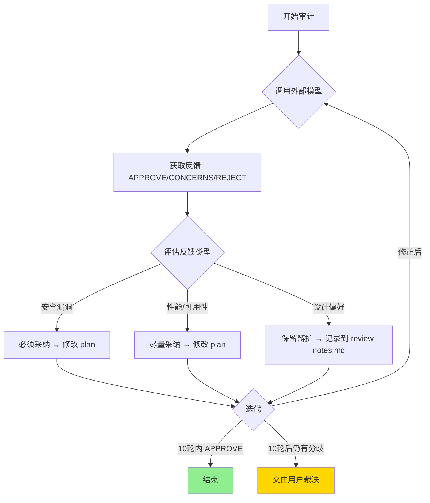

# audit-proposal

邀请外部模型（Qwen + Gemini）对设计方案进行评审，并根据反馈改进计划。

## 触发时机

在以下阶段调用：
- **brainstorming 阶段**：有初步想法时，快速发现方向性问题
- **writing-plans 阶段**：计划完成后，最后纠错

## 核心流程



1. **调用外部模型**：通过 main.py 脚本并行调用 Qwen 和 Gemini
2. **获取反馈**：接收审查意见（APPROVE / CONCERNS / REJECT）
3. **评估反馈**：
   - 安全相关问题（漏洞、越权等）→ 必须采纳
   - 性能/可用性问题 → 认真考虑，尽量采纳
   - 设计偏好 → 可以保留，但需在对话记录中辩护
4. **迭代处理**（最多 10 轮）：
   - 如果有修正 → 更新 plan 文件 → 再次调用审计
   - 如果要辩护 → 记录在 review-notes.md → 再次调用让模型看到
   - APPROVE → 结束
5. **结束条件**：
   - 两个模型都 APPROVE
   - 10 轮后仍有分歧 → 交由用户裁决

## 你的角色

你是**对等的 peer reviewer**。外部模型的意见是参考，不是圣旨。你需要：
- 尊重模型的专业建议
- 但也有权质疑模型的判断
- 最终目标是产出更好的设计方案，而不是盲目服从模型

## 对话记录

每次审计的对话都记录在 `docs/plans/<plan-name>-review-notes.md`：

```markdown
# 审查对话记录

## 第1轮
### 外部模型反馈
[模型的意见]

### 我的回应
[我的辩护/修改]

## 第2轮
...
```

下次调用时，将 plan 文件和 review-notes.md 一起传给模型，让它看到之前的讨论。

## 输入格式

### 自动发现 plan 文件（推荐）

skill 自动在以下位置查找最近修改的 plan：
- `$CWD/docs/plans/`
- `$HOME/.claude/plan/`

需要传入 cwd 和 transcript_path：

```bash
PLAN_FILE=$(find "$PWD/docs/plans" "$HOME/.claude/plan" -name "*.md" -type f -exec ls -t {} + 2>/dev/null | head -1)
echo "{\"plan\": \"\", \"cwd\": \"$PWD\", \"transcript_path\": \"$CLAUDE_TRANSCRIPT\"}" | jq --arg "$(cat "$PLAN_FILE")" '.plan = $arg' > /tmp/audit_input.json
uv run ${CLAUDE_PLUGIN_ROOT}/expert-auditor-pro/scripts/main.py --plan-file "$PLAN_FILE"
```

> 注意：`$CLAUDE_TRANSCRIPT` 是 Claude Code 提供的环境变量，包含当前会话的 transcript 路径。

### 手动指定 plan 文件

```bash
uv run ${CLAUDE_PLUGIN_ROOT}/expert-auditor-pro/scripts/main.py --plan-file "/path/to/plan.md"
```

### stdin JSON

```bash
echo '{"plan": "计划内容", "cwd": "/project", "transcript_path": "/path/to/transcript.jsonl"}' | uv run ${CLAUDE_PLUGIN_ROOT}/expert-auditor-pro/scripts/main.py
```

### 命令行参数

```bash
uv run ${CLAUDE_PLUGIN_ROOT}/expert-auditor-pro/scripts/main.py "计划内容"
```

## 输出格式

外部模型返回 Markdown 格式审查报告：

```markdown
# 双模型审计报告

## Qwen 审查结果
[审查意见，包含 decision: APPROVE/CONCERNS/REJECT]

## Gemini 审查结果
[审查意见]

## 综合结论
✅/⚠️/❌ 最终决定 + 原因 + 反馈
```

## 决策规则

| 场景 | 结果 |
|------|------|
| 任一模型 REJECT | 需处理反馈后才能继续 |
| 两个模型都 APPROVE | 结束，plan 可以执行 |
| 一个 APPROVE + 一个 CONCERNS | 警告通过 |
| 两个模型都 CONCERNS | 需处理反馈后才能继续 |

## 错误处理

- **找不到 plan 文件**：提示用户手动指定路径
- **API Key 未配置**：报错，提示用 `/setup_skill` 配置
- **两个模型都调用失败**：报错，无法继续
- **一个模型失败**：降级处理，用单模型结果继续

## 配置

```bash
# 配置 API Keys
cd ${CLAUDE_PLUGIN_ROOT}/expert-auditor-pro
uv run python scripts/config_manager.py --set-qwen-key "YOUR_KEY"
uv run python scripts/config_manager.py --set-gemini-key "YOUR_KEY"
```
